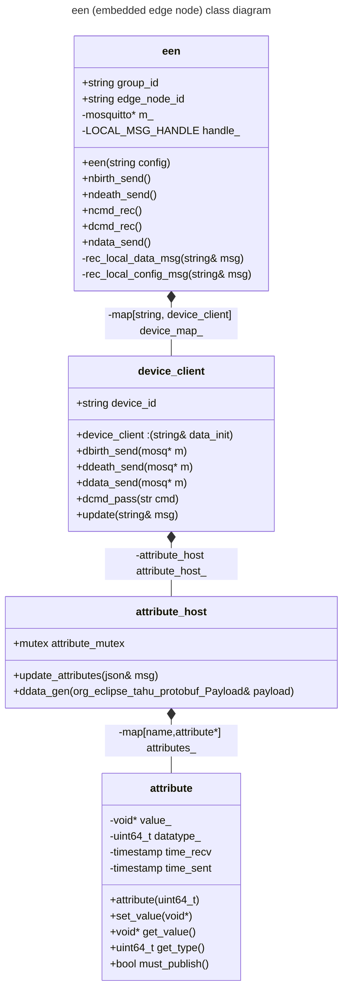

SparkPlugB Demo

- [1.description](#1-description)
- [2.use](#2-use)
  - [2.1 use with docker compose](#21-use-with-docker-compose)
  - [2.2 use with local applications](#22-use-with-local-applications)
    - [2.2.1 tahu setup](#221-tahu-setup)
    - [2.2.2 een](#222-een)
    - [2.2.3sub](#223-sub)
- [8. developer resources](#8-developer-resources)
- [9. TODO](#9-todo)

# 1. description
Architecture (deployed) :




# 2. use
## 2.1 use with docker compose
```
sudo docker compose build een sub
sudo docker compose --profile een --profile sub up
```

## 2.2. use with local applications
### 2.2.1 tahu setup
tahu must be built and installed
```
cd ..
git clone https://github.com/eclipse/tahu.git --branch v1.0.11
cd tahu

# disable SPARKPLUG_DEBUG printing
sed -i "s|#define SPARKPLUG_DEBUG 1|//#define SPARKPLUG_DEBUG 1 |g" c/core/include/tahu.h

# navigate to tahu repo
cd c/core
make
cp include/* /usr/local/include
cp lib/libtahu.a /usr/lib/
```
note that protobuf files can be rebuit as shown in `een`/`sub` Dockerfiles, but the stock tahu files seem to be okay (for now...)

### 2.2.2 een
```
cd een
mkdir -p build && cd build
cmake .. && make
een/een
```
### 2.2.3 sub
```
cd sub
mkdir -p build && cd build
cmake .. && make
sub/sub
```

# 8 developer resources
1. https://docs.docker.com/guides/cpp/containerize/
2. https://medium.com/codex/a-practical-guide-to-containerize-your-c-application-with-docker-50abb197f6d4
    - https://github.com/mostsignificant/simplehttpserver
3. https://cedalo.com/blog/mosquitto-docker-configuration-ultimate-guide/


# 9 TODO
- python containerized pub/sub containers
  - need fresh protocol files
    - `protoc --proto_path=sparkplug_b/ --python_out=python/core/ sparkplug_b/sparkplug_b.proto`
- reconnection attempt behavior